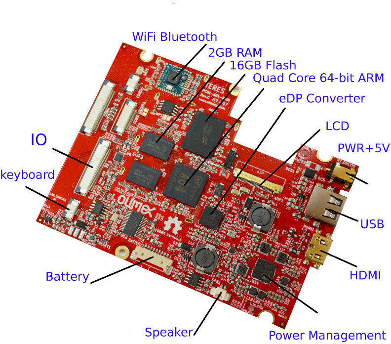

# Hardware

## Overview

All hardware schematics and board files are designed using [KiCad](http://kicad-pcb.org) open-source CAD software.

> KiCad is free software. KiCad is made available under the GNU General Public License(GPL) version 3 or greater.

All KiCad design files are available within the [HARDWARE](HARDWARE) directory within this repository.
You may download KiCad* and open for reviewing or editing each of the PCB files.
The schematics are also available as PDF files for easier viewing and/or printing.

**NOTE**: Make sure to download the latest KiCad nightly development build.
The latest stable build may not have the features required.

## Introduction to the hardware of TERES-I

The TERES-I electronics part consists of five boards:

### Main board (PCB1-A64-MAIN)

The main board (PCB1-A64-MAIN) contains:

* A64 processor
* RAM and flash NAND memories
* Power management unit
* LCD converter
* Connectors to different interfaces
* and others

It looks like this:

We expect to release extra main boards with different processors and memory configurations in the future.
These should work with all other existing boards.
It is expected newer main boards to have higher laptop speed and improved memory performance.

### Keyboard controller (TERES-PCB5-KEYBOARD)

The **KEYBOARD controller** board (**TERES-PCB5-KEYBOARD**) is responsible for handling the keyboard and touch pad interfaces.
This keyboard controller board allows you to completely reprogram the keyboard mapping and response according to your own taste.

The TERES-PCB5-KEYBOARD contains an AVR processor.
Sources, binaries and update procedures for the AVR firmware are available at GitHub.
You can update the firmware of the keyboard/touch controller live on the board itself.
It can also be programmed via an Arduino microcontroller.
Touch screen parameters can also be changed.

### I/O board (TERES-PCB2-IO)

The **IO** board (**TERES-PCB2-IO**) contains the USB connector, headphone/debug connector, SD card, speaker connector and microphone.

### Power button (PCB4-PWR-BTN)

The **PWR** button board (**PCB4-PWR-BTN**) handles the keys for powering on and off the laptop.

### Touch buttons (TERES-PCB3-TOUCH-BTN)

The **TOUCH** buttons board (**TERES-PCB3-TOUCH-BTN**) contains two buttons for left and right mouse click emulation.

